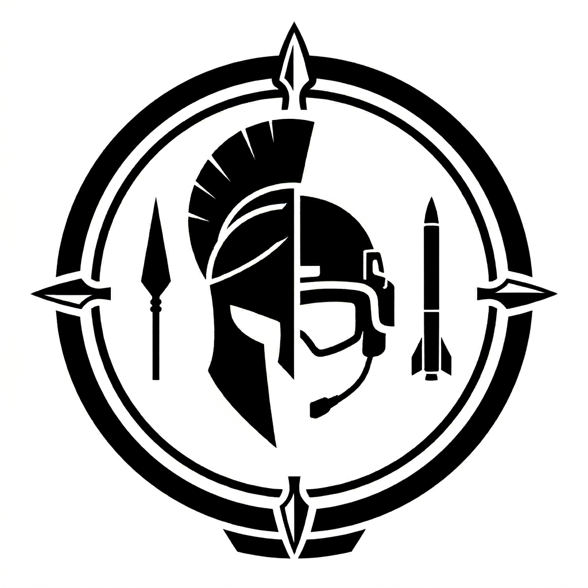

<p align="center">
  
</p>

<h1 align="center">BattleSight command-line tools</h1>

Four Go programs build, serve, and curate the catalog. Run each from the
repository root so the default `data/` paths resolve. Every flag has a
sensible default; the tables below list the ones worth overriding.

## `battlesight` — the server

Serves the HTTP API, seeds the database on startup, and hot-reloads the
curation JSON files (`phases.json`, `wars.json`) as you edit them.

```bash
go run ./cmd/battlesight
```

| Flag | Default | Purpose |
| --- | --- | --- |
| `-port` | `8080` | Listen port. |
| `-db` | `data/battlesight.db` | SQLite database path. |
| `-seed` | `data/battles.json` | Curated battles seeded on startup. Empty to skip. |
| `-phases` | `data/phases.json` | Replay file, watched for hot-reload. Empty to skip. |
| `-wars` | `data/wars.json` | War narratives, watched for hot-reload. Empty to skip. |

## `import` — the ingest and enrichment pipeline

Pulls battles from Wikidata, enriches them from Wikipedia, backfills
gaps, validates curated files, and merges replay drafts. Pick a phase
with a flag, or run `-all` for the full sequence. `-network=false`
refuses every outbound request and serves only from the disk cache.

```bash
go run ./cmd/import -all                          # full pull and enrichment
go run ./cmd/import -validate                     # check curated JSON, no writes
go run ./cmd/import -merge-replays drafts.json    # validate and merge replay drafts
```

| Flag | Purpose |
| --- | --- |
| `-json <file>` | Import a curated battles JSON file. |
| `-wikidata` | Pull the battle catalog from Wikidata SPARQL. |
| `-enrich` | Fetch Wikipedia summaries for battles missing them. |
| `-infobox` | Fetch sides, commanders, and casualties from infoboxes. |
| `-significance` | Fetch aftermath and legacy sections. |
| `-references` | Extract citation URLs into `battle_references`. |
| `-geocode-missing` | Backfill coordinates from the Wikipedia coordinates API. |
| `-infobox-backfill` | Backfill coordinates and dates from infobox text. |
| `-wars` | Enrich `data/wars.json` for wars with enough battles. |
| `-merge-replays <file>` | Validate a replay-draft file and merge it into `phases.json`. |
| `-validate` | Validate curated JSON without writing. Non-zero exit on error. |
| `-all` | Run every import and enrichment step. |
| `-network` | Allow outbound HTTP. Set `-network=false` to serve only the cache. |

The `-*-dry-run` companions to the geocode and infobox flags print the
would-be summary without touching the database.

## `fixdates` — year and era repair

One-shot pass over battles with `year = 0` but a non-empty date string.
Parses the year from the date, writes it back, and derives the era.

```bash
go run ./cmd/fixdates
```

## `quality` — the completeness report

Scores every battle on which fields are populated and writes a per-era,
per-region, per-war markdown report. The score measures completeness,
not factual accuracy: a true entry missing coordinates still ranks low.
Use it to direct curation, not as a measure of truth.

```bash
go run ./cmd/quality                    # writes to ~/Downloads
go run ./cmd/quality -out report.md
```

| Flag | Default | Purpose |
| --- | --- | --- |
| `-db` | `data/battlesight.db` | SQLite database path. |
| `-out` | `~/Downloads/battlesight-quality-<date>.md` | Report output path. |
