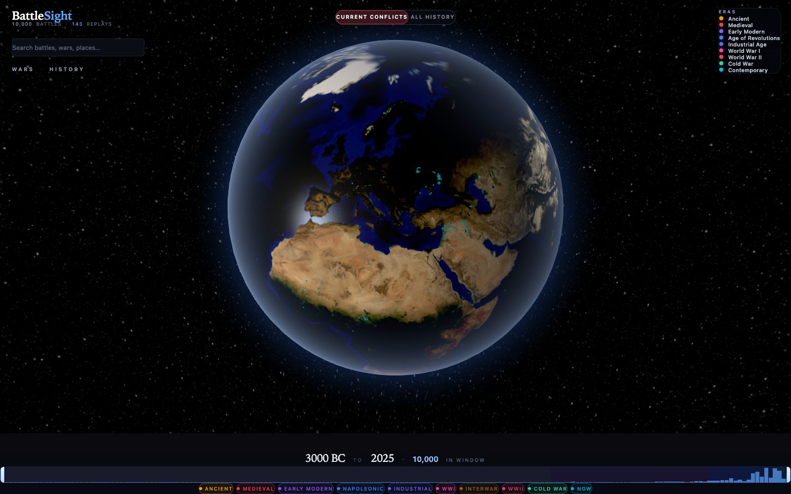

# BattleSight

{ .hero-logo }

# BattleSight

Every battle in history, on one globe.

More than thirteen thousand battles across five thousand years, placed on a cinematic 3D globe. Zoom from a whole war down to the terrain of a single field, then watch the engagement replay phase by phase.

[Explore the docs](usage.md){ .md-button .md-button--primary }
[View on GitHub](https://github.com/dcadolph/battlesight){ .md-button }

  

## What it does

-   :material-earth:{ .lg } __A globe, not a map__

    Thirteen thousand battles rendered on a relief globe. Fly from a
    continental theater down to the ridgelines of a single battlefield.

-   :material-movie-open:{ .lg } __Cinematic replays__

    Curated engagements play back phase by phase, with tapered advance
    arrows and a war cinematic that walks a whole campaign in sequence.

-   :material-map-legend:{ .lg } __Territory over time__

    Per-war country-level shading shows who held what, and how the front
    moved as the war unfolded.

-   :material-shield-check:{ .lg } __Honest data tiers__

    Three tiers of trust, with a badge on every battle so you always know
    whether you are looking at curated, verified, or imported data.

## Start here

- [Usage](usage.md) — shareable URLs, controls, and how to navigate.
- [Authoring](authoring.md) — curate phase replays, war narratives, and territory snapshots.
- [Cinematic mode](cinematic.md) — how the war cinematic times and advances.
- [Data quality](data-quality.md) — what the trust tiers mean.
- [Architecture](architecture.md) — how the stack fits together.
- [HTTP API](api.md) — the JSON endpoints behind the frontend.
